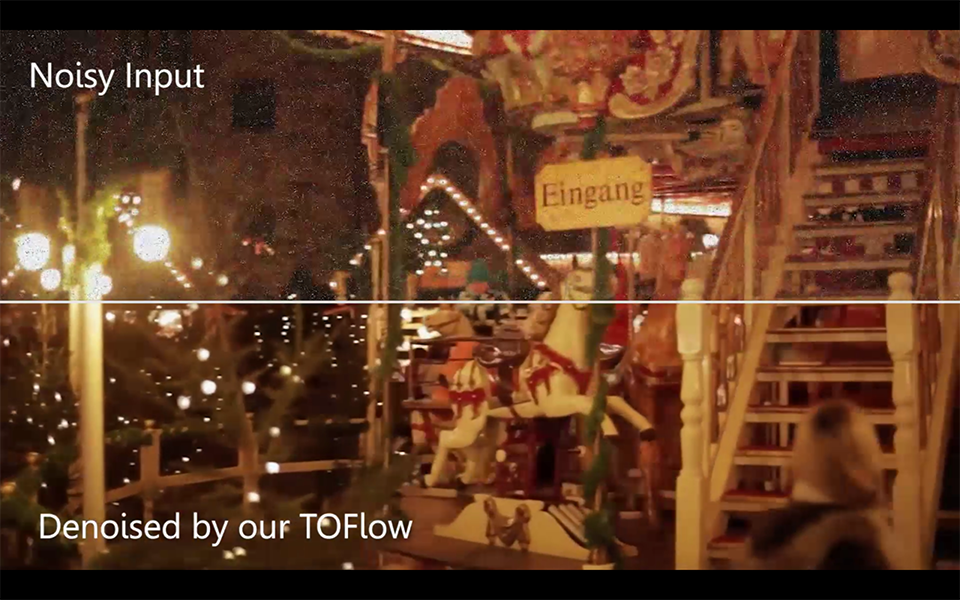

# TOFlow: Video Enhancement with Task-Oriented Flow

This repository is based on the project 'TOFlow: Video Enhancement with Task-Oriented Flow'. It contains pre-trained models and a demo code. It also includes the description and download scripts for the Vimeo-90K dataset we collected.

## Video Demo

[](http://www.youtube.com/watch?v=msC5GK9aV9Q "Video Demo")

If you cannot access YouTube, please download 1080p video from [here](http://toflow.csail.mit.edu/toflow.mp4).

## Prerequisites

#### Torch
Our implementation is based on Torch 7 (http://torch.ch).

#### CUDA [optional]
CUDA is suggested (https://developer.nvidia.com/cuda-toolkit) for fast inference. The demo code is still runnable without CUDA, but much slower.

#### Matlab [optional]
We use Matlab for generating video denoising/super-resolution dataset and quantitative evaluation require Matlab installation (https://www.mathworks.com/products/matlab.html). It is not necessary for the demo code.

#### FFmpeg [optional]
We use FFmpeg (http://ffmpeg.org) for generating video deblocking dataset. It is not necessary for the demo code.

## Installation
Our current release has been tested on Ubuntu 14.04.

#### Clone the repository
```sh
git clone https://github.com/anchen1011/toflow.git
```

#### Install dependency
```sh
cd toflow/src/stnbhwd
luarocks make
```
This will install 'stn' package for Lua. The list of components:
```lua
require 'stn'
nn.AffineGridGeneratorBHWD(height, width)
-- takes B x 2 x 3 affine transform matrices as input, 
-- outputs a height x width grid in normalized [-1,1] coordinates
-- output layout is B,H,W,2 where the first coordinate in the 4th dimension is y, and the second is x
nn.BilinearSamplerBHWD()
-- takes a table {inputImages, grids} as inputs
-- outputs the interpolated images according to the grids
-- inputImages is a batch of samples in BHWD layout
-- grids is a batch of grids (output of AffineGridGeneratorBHWD)
-- output is also BHWD
nn.AffineTransformMatrixGenerator(useRotation, useScale, useTranslation)
-- takes a B x nbParams tensor as inputs
-- nbParams depends on the contrained transformation
-- The parameters for the selected transformation(s) should be supplied in the
-- following order: rotationAngle, scaleFactor, translationX, translationY
-- If no transformation is specified, it generates a generic affine transformation (nbParams = 6)
-- outputs B x 2 x 3 affine transform matrices
```

#### Download pretrained models (104MB) 
```sh
cd ../../
./download_models.sh
``` 

## Run Demo Code
```sh
cd src
th demo.lua -mode interp -inpath ../data/example/low_frame_rate
th demo.lua -mode denoise -inpath ../data/example/noisy
th demo.lua -mode deblock -inpath ../data/example/block
th demo.lua -mode sr -inpath ../data/example/blur
```

There are a few options in demo.lua:

**nocuda**: Set this option when CUDA is not available.

**gpuId**: GPU device ID.

**mode**: There are four options:
- 'interp': temporal frame interpolation
- 'denoise': video denoising 
- 'deblock': video deblocking
- 'sr': video super-resolution

**inpath**: The path to the input sequence.

**outpath**: The path to where the result stores (default is ../demo_output).


## Vimeo-90K Dataset

We also build a large-scale, high-quality video dataset, Vimeo90K. This dataset consists of 89,800 video clips  downloaded from [vimeo.com](vimeo.com), which covers large variaty of scenes and actions. It is designed for the following four video processing tasks: temporal frame interpolation, video denoising, video deblocking, and video super-resolution.


We further process these 89,800 video clips to generate the following two subsets (the orignal video clips will come out soon):

#### Triplet dataset for temporal frame interpolation

The triplet dataset consists of 73171 3-frame sequences with a fixed resolution of 448 x 256, extracted from 15k selected video clips from Vimeo-90K. This dataset is designed for temporal frame interpolation. Download links are:

Testing set only: [zip (1.7GB)](http://data.csail.mit.edu/tofu/testset/vimeo_interp_test.zip).

Both training for testing set: [zip (33GB)](http://data.csail.mit.edu/tofu/dataset/vimeo_triplet.zip).

#### Septuplet dataset for video denoising, super-resolution, and deblocking

The septuplet dataset consists of 91701 7-frame sequences with fixed resolution 448 x 256, extracted from 39k selected video clips from Vimeo-90k. This dataset is designed to video denoising, deblocking, and super-resolution.

The testing set for video denoising: [zip (16GB)](http://data.csail.mit.edu/tofu/testset/vimeo_denoising_test.zip).

The testing set for video deblocking: [zip (11GB)](http://data.csail.mit.edu/tofu/testset/vimeo_sep_block.zip).

The testing set for video super-resolution: [zip (6GB)](http://data.csail.mit.edu/tofu/testset/vimeo_super_resolution_test.zip).

The original testing set (not downsampled or downgraded by noise): [zip (15GB)](http://data.csail.mit.edu/tofu/testset/vimeo_test_clean.zip).

The original training + testing set (consists of 91701 sequences, which are not downsampled or downgraded by noise): [zip (82GB)](http://data.csail.mit.edu/tofu/dataset/vimeo_septuplet.zip).

#### Generate Testing Sequences

See src/generate_testing_sample for the functions to generate noisy/low-resolution sequences.

To generate noisy sequences with Matlab under src/generate_testing_sample, run
```
add_noise_to_input(data_path, output_path);
``` 
and the results will be stored under output_path

To generate blur sequences with Matlab, run
```
blur_input(data_path, output_path);
```
and the results will be stored under output_path

Blocky sequences are compressed by FFmpeg. Our test set is generated with the following configuration:
```sh
ffmpeg -i *.png -q 20 -vcodec jpeg2000 -format j2k name.mov 
```

## Run Quantitative Evaluation

#### Download all four Vimeo testsets (52G) 
```sh
./download_testset.sh
``` 

#### Run inference on Vimeo testsets
```sh
cd src
th demo_vimeo90k.lua -mode interp
th demo_vimeo90k.lua -mode denoise
th demo_vimeo90k.lua -mode deblock
th demo_vimeo90k.lua -mode sr
```

#### Evaluation

We use three metrics to evaluate the performance of our algorithm: PSNR, SSIM, and Abs metrics. To run evaluation, execute following commands in Matlab:
```
cd src/evaluation
evaluate(output_dir, target_dir);
``` 

For example, to evaluate results generated in the previous step, run
```
cd src/evaluation
evaluate('../../output/interp', '../../data/vimeo_interp_test/target', 'interp')
evaluate('../../output/denoise', '../../data/vimeo_test_clean/sequences', 'denoise')
evaluate('../../output/deblock', '../../data/vimeo_test_clean/sequences', 'deblock')
evaluate('../../output/sr', '../../data/vimeo_test_clean/sequences', 'sr')
```

It is assumed that our datasets are unzipped under data/ and not renamed. It is also assumed that results are put under [output_root]/[task_name] e.g. output/sr output/interp output/denoise output/deblock, with exactly the same subfolder structure as our datasets.

## References
1. Our warping code is based on [qassemoquab/stnbhwd](https://github.com/qassemoquab/stnbhwd).
2. Our flow utilities and transformation utilities are based on [anuragranj/spynet](https://github.com/anuragranj/spynet)
